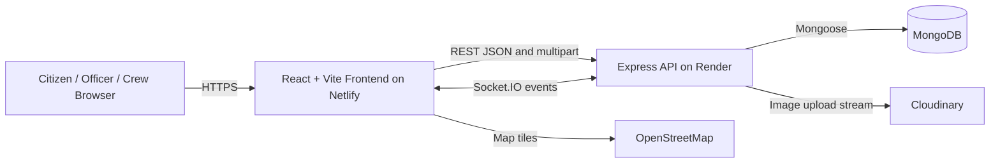

# CSE471: System Analysis and Design
## Project Report

### Ekotro (একত্র) - Bringing Governance Together

| Item | Details |
|---|---|
| Course | CSE471: System Analysis and Design |
| Group No. | 02 |
| Lab Section | 15 |
| Semester | Summer 2026 |
| Submission Date | 29 June 2026 |
| GitHub Repository | [https://github.com/rifff-fin/471gg](https://github.com/rifff-fin/471gg) |
| Live Frontend | [https://ekotro.netlify.app/](https://ekotro.netlify.app/) |
| Backend | [https://ekotrobackend.onrender.com/](https://ekotrobackend.onrender.com/) |

> **Implementation note:** The original proposal template mentions TypeScript, Next.js, and TailwindCSS. The delivered repository uses JavaScript, React 19, Vite, and CSS. This report documents the implemented system so that the technical claims match the submitted code.

## Team Members

| Student ID | Name |
|---|---|
| 24141141 | Ariful Islam Naeem |
| 23301214 | Samara Shahjeen Huq |
| 22201979 | Abdullah Al Rifat |
| 23101321 | S M Sabbir Haque Emon |

## Table of Contents

1. [System Request](#1-system-request)
2. [Functional Requirements](#2-functional-requirements)
3. [Technology](#3-technology-framework-languages)
4. [Backend Development](#4-backend-development)
5. [User Interface Design](#5-user-interface-design)
6. [Frontend Development](#6-frontend-development)
7. [User Manual](#7-user-manual)
8. [Performance and Network Analysis](#8-performance-and-network-analysis)
9. [GitHub Repository](#9-github-repository)
10. [Deployed Project](#10-deployed-project)
11. [Individual Contribution](#11-individual-contribution)
12. [References](#12-references)

---

## 1. System Request

### Business Need

Citizens often have no single, transparent channel for reporting local problems, following progress, communicating with officials, requesting government services, or checking enforcement actions. Government teams also need a shared system to prioritize cases, assign field workers, exchange updates, verify completed work, and monitor service performance.

Ekotro addresses this gap with a unified civic governance platform. It connects citizens, ward-level authorities, officers, police officers, administrators, and field workers around a common complaint and service workflow.

### Business Requirements

The system shall:

- Let authenticated citizens submit civic complaints with title, category, description, ward, location, optional images, and priority information.
- Make public complaints searchable and filterable by category, status, date, priority, and location.
- Allow citizens to edit or delete their own unassigned complaints.
- Provide map-based complaint discovery using Leaflet and MongoDB geospatial queries.
- Support public comments, threaded replies, votes, and real-time complaint activity.
- Let officials publish announcements and responses.
- Let officers review cases, assign field workers, place cases on hold, release held cases, and maintain a public ledger.
- Let field workers submit completion reports with before-and-after evidence.
- Provide unified government service requests for passports, driving licenses, birth certificates, and similar services.
- Let police officers issue digital fines and let citizens view and track their fines.
- Provide role-based dashboards, notifications, analytics, SLA monitoring, and hotspot information.

### Business Value

- **Citizens:** one portal for reporting issues, requesting services, communicating, and tracking outcomes.
- **Government officers:** structured case queues, role-based access, assignment tools, public audit history, and analytics.
- **Field crews:** direct task assignments, internal coordination, progress updates, and evidence submission.
- **Administrators:** visibility into complaint volume, SLA breaches, hotspots, department activity, and engagement.
- **Community:** greater transparency because public updates, votes, status changes, and ledger events are visible.

### Special Issues or Constraints

- Users require an internet connection and a modern browser.
- MongoDB, Cloudinary, Render, Netlify, OpenStreetMap tiles, and Socket.IO are external service dependencies.
- Cloudinary credentials must be configured on the backend before image uploads can succeed.
- The backend may sleep on the Render free tier, causing the first request to take longer.
- Location access depends on browser permissions; users can also enter latitude and longitude manually.
- Authentication and authorization depend on valid JWT configuration and role data.
- Uploaded files are restricted by the server upload middleware to image files, with a maximum of eight complaint attachments and twelve megabytes per file.
- The report must include original screenshots from the deployed system and tools. Placeholder entries are marked below and should be replaced before submission.

---

## 2. Functional Requirements

| No. | Functional requirement | Assigned member | Implemented evidence |
|---:|---|---|---|
| 1 | Citizens submit complaints with title, category, description, location, and priority | Abdullah Al Rifat | `ReportIssue.jsx`, `complaintRoutes.js`, `Complaint.js` |
| 2 | Citizens browse, search, and filter public complaints | Samara Shahjeen Huq | `Feed.jsx`, public complaint API |
| 3 | Cloudinary handles complaint image hosting, compression, and delivery | S M Sabbir Haque Emon | `services/cloudinary.js`, upload middleware |
| 4 | Citizens edit, update, or delete their own unassigned complaints | Ariful Islam Naeem | `updateComplaint`, `deleteComplaint`, edit page |
| 5 | Leaflet and MongoDB geospatial indexing support complaint maps and nearby queries | Ariful Islam Naeem | `MapPicker.jsx`, `Complaint.js`, `/nearby` route |
| 6 | Citizens comment on complaints and reply to comments | Samara Shahjeen Huq | comment and reply endpoints, complaint detail page |
| 7 | Socket.IO supports real-time public complaint activity | Abdullah Al Rifat | `services/realtime.js`, notification components |
| 8 | Citizens upvote or downvote existing complaints | S M Sabbir Haque Emon | `/upvote` and `/vote` endpoints |
| 9 | Councillors and mayors publish official responses, updates, and announcements | Abdullah Al Rifat | announcement routes, mayor dashboard |
| 10 | Field workers upload completion reports with before-and-after images | Ariful Islam Naeem | completion report routes and upload page |
| 11 | Cloudinary processes before-and-after field evidence | Abdullah Al Rifat | `toMediaList`, Cloudinary upload stream |
| 12 | Socket.IO provides internal officer and crew coordination | S M Sabbir Haque Emon | coordination rooms and events in `realtime.js` |
| 13 | Citizens submit and track government service requests | Samara Shahjeen Huq | service request routes and government services page |
| 14 | Officers review, approve, reject requests, and assign officer roles | Abdullah Al Rifat | officer routes, service request controller, admin dashboard |
| 15 | Officers can put complex complaints into `HELD_PENDING` with a mandatory rationale and ledger event | S M Sabbir Haque Emon | hold/release endpoints and `publicLedger` model field |
| 16 | Police officers issue digital fines with evidence | Ariful Islam Naeem | fine routes, `fineController.js`, police dashboard |
| 17 | Citizens view fines and follow review/dispute information | Samara Shahjeen Huq | My Fines page and fine API |
| 18 | Administrators monitor analytics, performance, engagement, requests, and activity | Abdullah Al Rifat | admin stream and analytics endpoints/dashboard |

### Main User Roles

- **Citizen:** reports issues, comments, votes, requests services, views fines, and receives updates.
- **Officer:** reviews complaints and service requests, assigns crews, verifies reports, and coordinates work.
- **Councillor/Mayor:** publishes official responses and announcements and can manage jurisdictional updates.
- **Field worker:** receives maintenance assignments, posts progress, and uploads completion evidence.
- **Police officer:** issues and views digital fines.
- **Administrator:** manages users and system-wide operational dashboards.

---

## 3. Technology (Framework, Languages)

| Layer | Implemented technology |
|---|---|
| Frontend language | JavaScript / JSX |
| Frontend framework | React 19 |
| Frontend build tool | Vite |
| Routing | React Router |
| Styling | Project CSS (`App.css`, `index.css`) |
| Backend language | JavaScript, CommonJS |
| Backend framework | Express 5 |
| Database | MongoDB |
| ODM | Mongoose |
| Authentication | JWT and bcryptjs |
| File upload | Multer |
| Media platform | Cloudinary |
| Maps | Leaflet and React Leaflet with OpenStreetMap tiles |
| Real-time communication | Socket.IO and socket.io-client |
| Frontend hosting | Netlify |
| Backend hosting | Render |

### High-Level Architecture



---

## 4. Backend Development

The backend is an Express API organized into routes, controllers, models, middleware, and services. JWT middleware protects private routes, while role authorization limits operations to the correct actor.

### Backend Snippet 1: Express and Socket.IO Server Setup

**File:** [`server.js`](server.js)

```javascript
const app = express();
const httpServer = http.createServer(app);

const io = new Server(httpServer, {
  cors: {
    origin: process.env.CLIENT_ORIGIN || "*",
    methods: ["GET", "POST", "PUT", "PATCH", "DELETE"],
  },
});

app.set("io", io);
registerSocketHandlers(io);
app.use(express.json());
app.use(express.urlencoded({ extended: true, limit: "10mb" }));

app.use("/api/auth", authRoutes);
app.use("/api/complaints", complaintRoutes);
app.use("/api/fines", fineRoutes);
app.use("/api/service-requests", serviceRequestRoutes);
```

**Description:** Creates the HTTP server, attaches Socket.IO, enables JSON and form parsing, and mounts the main feature APIs.

### Backend Snippet 2: Protected Complaint Routes

**File:** [`routes/complaintRoutes.js`](routes/complaintRoutes.js)

```javascript
router.post(
  "/",
  protect,
  authorize("citizen"),
  upload.array("attachments", 8),
  createComplaint,
);

router.put("/:id", protect, authorize("citizen"), updateComplaint);
router.delete("/:id", protect, authorize("citizen"), deleteComplaint);

router.post(
  "/:id/reports",
  protect,
  authorize("field_worker", "officer", "admin"),
  upload.fields([
    { name: "beforeImages", maxCount: 5 },
    { name: "afterImages", maxCount: 5 },
  ]),
  addCompletionReport,
);
```

**Description:** Demonstrates authentication, role authorization, and separate upload rules for citizen complaints and field-worker completion reports.

### Backend Snippet 3: JWT Authentication and Role Authorization

**File:** [`middleware/authMiddleware.js`](middleware/authMiddleware.js)

```javascript
const protect = (req, res, next) => {
  const authHeader = req.headers.authorization;

  if (!authHeader || !authHeader.startsWith("Bearer ")) {
    return res.status(401).json({
      success: false,
      message: "Authentication required",
    });
  }

  const token = authHeader.split(" ")[1];
  req.user = jwt.verify(token, JWT_SECRET);
  next();
};

const authorize = (...roles) => (req, res, next) => {
  if (!req.user || !roles.includes(req.user.role)) {
    return res.status(403).json({
      success: false,
      message: `Access denied. Required role: ${roles.join(" or ")}`,
    });
  }
  next();
};
```

**Description:** Verifies the bearer token and prevents users from accessing routes outside their assigned role.

### Backend Snippet 4: Cloudinary Image Upload and Compression

**File:** [`services/cloudinary.js`](services/cloudinary.js)

```javascript
const uploadBuffer = (buffer, options = {}) => {
  if (!buffer || !buffer.length) {
    return Promise.reject(new Error("No upload buffer provided."));
  }

  return new Promise((resolve, reject) => {
    const stream = cloudinary.uploader.upload_stream(
      {
        folder: options.folder || "ekotro",
        resource_type: options.resource_type || "image",
        transformation: options.transformation || [
          { quality: "auto:good" },
        ],
        unique_filename: true,
      },
      (error, result) => (error ? reject(error) : resolve(result)),
    );

    const readable = new PassThrough();
    readable.end(buffer);
    readable.pipe(stream);
  });
};
```

**Description:** Sends the in-memory upload stream directly to Cloudinary, applies automatic image quality optimization, and returns the hosted image result without writing files to the server disk.

### Backend Snippet 5: Geospatial Complaint Model

**File:** [`models/Complaint.js`](models/Complaint.js)

```javascript
location: {
  type: { type: String, enum: ["Point"], default: "Point" },
  coordinates: { type: [Number], required: true },
},

complaintSchema.index({ location: "2dsphere" });
```

**Description:** Stores locations in GeoJSON Point format as `[longitude, latitude]` and creates a MongoDB `2dsphere` index for nearby and spatial complaint queries.

### Backend Snippet 6: Complaint Location Normalization

**File:** [`controllers/complaintController.js`](controllers/complaintController.js)

```javascript
const normalizeLocation = (body = {}) => {
  const rawLat = body.latitude ?? body.lat ?? body.locationLat;
  const rawLng = body.longitude ?? body.lng ?? body.locationLng;
  const lat = Number(rawLat);
  const lng = Number(rawLng);

  if (
    Number.isFinite(lat) &&
    Number.isFinite(lng) &&
    Math.abs(lat) <= 90 &&
    Math.abs(lng) <= 180
  ) {
    return { type: "Point", coordinates: [lng, lat] };
  }

  return null;
};
```

**Description:** Accepts common latitude and longitude field names, validates coordinate ranges, and converts them to the GeoJSON structure used by MongoDB.

### Backend API Summary

| Feature | Method and path | Access |
|---|---|---|
| Public complaint feed | `GET /api/complaints` | Public |
| Nearby complaints | `GET /api/complaints/nearby` | Public |
| Create complaint | `POST /api/complaints` | Citizen |
| Edit/delete own complaint | `PUT/DELETE /api/complaints/:id` | Citizen owner |
| Comment and reply | `POST /api/complaints/:id/comments` | Authenticated |
| Upvote/vote | `POST /api/complaints/:id/upvote` or `/vote` | Authenticated |
| Hold/release complaint | `POST /api/complaints/:id/hold` or `/release` | Officer, councillor, mayor, admin |
| Completion report | `POST /api/complaints/:id/reports` | Field worker, officer, admin |
| Service request | `POST /api/service-requests` | Citizen |
| Issue fine | `POST /api/fines` | Police |
| Citizen fines | `GET /api/fines/my` | Citizen |
| Admin analytics | `GET /api/complaints/admin/analytics` | Admin/officer |

### Postman Evidence Checklist

Add screenshots below after testing the deployed backend. Each screenshot should show the request method, URL, authorization/body, status code, and response body.

- **[Insert Screenshot: Postman 1]** `POST /api/auth/login` returns a JWT token.
- **[Insert Screenshot: Postman 2]** `POST /api/complaints` creates a complaint with multipart fields and an attachment.
- **[Insert Screenshot: Postman 3]** `POST /api/complaints/:id/hold` returns a held complaint and records the reason.
- **[Insert Screenshot: Postman 4]** `POST /api/complaints/:id/reports` accepts before/after images.
- **[Insert Screenshot: Postman 5]** `POST /api/fines` creates a police digital fine.
- **[Insert Screenshot: Postman 6]** `GET /api/complaints/nearby` returns location-filtered results.

---

## 5. User Interface Design

The interface uses a civic-service visual language with a persistent navigation bar, role-specific dashboards, responsive forms, complaint cards, status indicators, map views, notifications, and focused detail pages.

### Required Figma Evidence

The following five designs should be exported from the team Figma file as PNG/JPG images and inserted into this section:

1. **[Insert Figma Screenshot 1]** Citizen complaint feed with search and filters.
2. **[Insert Figma Screenshot 2]** Complaint submission form with map picker and image upload.
3. **[Insert Figma Screenshot 3]** Complaint detail page with status, votes, comments, and activity.
4. **[Insert Figma Screenshot 4]** Officer/admin dashboard with case analytics and map data.
5. **[Insert Figma Screenshot 5]** Mobile responsive view of the complaint or service workflow.

**Figma project link:** `[Paste the team's public Figma URL here]`

> The GitHub repository and deployed URLs are available above, but no Figma URL was provided in the project request. Add the actual public Figma link before submission.

---

## 6. Frontend Development

The frontend is a React single-page application. React Router maps user roles to protected pages, Axios provides the API client, Leaflet handles map interaction, and Socket.IO displays live notifications.

### Frontend Snippet 1: Axios API Client and JWT Header

**File:** [`frontend/src/services/api.js`](frontend/src/services/api.js)

```javascript
export const API_BASE_URL =
  import.meta.env.VITE_API_BASE_URL || "http://localhost:1141/api";
export const SOCKET_URL =
  import.meta.env.VITE_SOCKET_URL || API_BASE_URL.replace(/\/api\/?$/, "");

const api = axios.create({ baseURL: API_BASE_URL });

api.interceptors.request.use((config) => {
  const token = localStorage.getItem("token");
  if (token) config.headers.Authorization = `Bearer ${token}`;
  return config;
});
```

**Description:** Uses environment configuration for deployment and automatically adds the stored JWT to authenticated API requests.

### Frontend Snippet 2: Complaint Submission with FormData

**File:** [`frontend/src/pages/ReportIssue.jsx`](frontend/src/pages/ReportIssue.jsx)

```javascript
const submit = async (event) => {
  event.preventDefault();
  setSaving(true);
  setError("");
  try {
    const data = new FormData();
    Object.entries(form).forEach(([key, value]) => data.append(key, value));
    files.forEach((file) => data.append("attachments", file));
    const response = await api.post("/complaints", data);
    navigate(`/complaints/${response.data.data._id}`);
  } catch (requestError) {
    setError(
      requestError.response?.data?.message || "Could not submit your report.",
    );
  } finally {
    setSaving(false);
  }
};
```

**Description:** Collects form values and optional image files in a multipart request and routes the user to the newly created complaint.

### Frontend Snippet 3: Leaflet Location Picker

**File:** [`frontend/src/components/MapPicker.jsx`](frontend/src/components/MapPicker.jsx)

```javascript
function LocationMarker({ onLocationSelect }) {
  const [position, setPosition] = useState(null);

  useMapEvents({
    click(e) {
      const location = { lat: e.latlng.lat, lng: e.latlng.lng };
      setPosition(location);
      onLocationSelect(location);
    },
  });

  return position ? <Marker position={[position.lat, position.lng]} /> : null;
}
```

**Description:** Converts a map click into latitude and longitude values and displays a marker at the selected location.

### Frontend Snippet 4: Role-Based Route Protection

**File:** [`frontend/src/App.jsx`](frontend/src/App.jsx)

```javascript
<Route
  path="/officer-dashboard"
  element={
    <RoleProtectedRoute allowedRoles={["officer", "admin"]}>
      <OfficerDashboard />
    </RoleProtectedRoute>
  }
/>

<Route
  path="/police/create-fine"
  element={
    <RoleProtectedRoute allowedRoles={["police"]}>
      <CreateFine />
    </RoleProtectedRoute>
  }
/>
```

**Description:** Shows how the client hides and protects pages based on the authenticated user role. The backend independently enforces the same authorization rules.

### Frontend Snippet 5: Real-Time Notifications

**File:** [`frontend/src/components/NotificationCenter.jsx`](frontend/src/components/NotificationCenter.jsx)

```javascript
useEffect(() => {
  if (!user || !token) return undefined;
  const socket = io(SOCKET_URL, {
    transports: ["websocket", "polling"],
    auth: { token },
  });

  socket.on("notification:new", (payload) => {
    window.dispatchEvent(new Event("notification:received"));
    setNotice({
      message: payload.message || payload.title || "You have a new case update.",
    });
  });

  return () => socket.disconnect();
}, [user, token]);
```

**Description:** Opens a token-authenticated Socket.IO connection, shows live case notifications, and disconnects cleanly when the user session changes.

---

## 7. User Manual

### 7.1 Register and Log In

1. Open [https://ekotro.netlify.app/](https://ekotro.netlify.app/).
2. Select **Register** and provide a name, email, and password.
3. Log in with the registered credentials.
4. The system stores the JWT session and displays features allowed for the user role.

**[Insert Screenshot: Registration page]**

**[Insert Screenshot: Login page]**

### 7.2 Submit a Complaint

1. Select **Report issue**.
2. Enter the issue title, category, description, and ward or area.
3. Click the map to select the exact location, use the current location button, or enter coordinates manually.
4. Add optional image evidence.
5. Select **Submit community report**.
6. Review the created complaint detail page.

**[Insert Screenshot: Complaint submission form]**

### 7.3 Browse, Search, Vote, and Comment

1. Open the home feed to browse public complaints.
2. Search or filter by category, status, date, or priority.
3. Open a complaint for its location, timeline, evidence, and ledger.
4. Use the vote/support control to indicate community priority.
5. Add a public comment or reply to an existing comment.
6. Watch for live activity and notification updates.

**[Insert Screenshot: Complaint feed with filters]**

**[Insert Screenshot: Complaint detail and comments]**

### 7.4 Edit or Delete a Complaint

1. Open **My Complaints**.
2. Choose an unassigned complaint.
3. Select **Edit** to change its information or **Delete** to remove it.
4. Once assigned to a department, the complaint should no longer be editable by the citizen.

**[Insert Screenshot: My Complaints page]**

### 7.5 Use Government Services

1. Open **Government Services**.
2. Select a service such as passport, driving license, or birth certificate.
3. Submit the request and description.
4. Open the personal request list to track `Pending`, `Processing`, `Approved`, `Rejected`, or `Completed` status.

**[Insert Screenshot: Government Services page]**

### 7.6 Officer, Mayor, Admin, and Field Worker Workflows

- **Officer:** open the officer dashboard, review cases, assign a crew, hold or release a complex case, and verify completion reports.
- **Mayor/Councillor:** publish official updates or announcements for citizens.
- **Field worker:** open an assignment, post progress, and submit before-and-after evidence.
- **Administrator:** inspect analytics, system activity, SLA breaches, and complaint hotspots.
- **Police officer:** create digital fines from the police dashboard and inspect issued fines.
- **Citizen:** open **My Fines** to view received fines and available review/dispute information.

**[Insert Screenshot: Officer dashboard]**

**[Insert Screenshot: Field completion report]**

**[Insert Screenshot: Police fine form]**

---

## 8. Performance and Network Analysis

### Lighthouse Procedure

Run Lighthouse against the deployed frontend in Chrome DevTools:

1. Open [https://ekotro.netlify.app/](https://ekotro.netlify.app/).
2. Open DevTools and select the **Lighthouse** tab.
3. Select **Mobile** and categories **Performance**, **Accessibility**, **Best Practices**, and **SEO**.
4. Select **Analyze page load**.
5. Repeat with the **Desktop** setting.
6. Save screenshots showing the category scores and key metrics.

### Report Table

Fill the measured values from the Lighthouse run before submission.

| Metric | Mobile result | Desktop result |
|---|---:|---:|
| Performance score | `[fill]` | `[fill]` |
| Accessibility score | `[fill]` | `[fill]` |
| Best Practices score | `[fill]` | `[fill]` |
| SEO score | `[fill]` | `[fill]` |
| First Contentful Paint | `[fill]` | `[fill]` |
| Largest Contentful Paint | `[fill]` | `[fill]` |
| Total Blocking Time | `[fill]` | `[fill]` |
| Cumulative Layout Shift | `[fill]` | `[fill]` |

### Interpretation

The main network dependencies are the Netlify frontend bundle, the Render API, MongoDB accessed through the API, Cloudinary image delivery, Socket.IO connections, and OpenStreetMap map tiles. A cold Render instance may increase the initial API response time. Large images are sent through Cloudinary with automatic quality optimization, reducing delivery cost and improving loading compared with serving original files from the API server.

**[Insert Screenshot: Lighthouse mobile report]**

**[Insert Screenshot: Lighthouse desktop report]**

**[Insert Screenshot: Browser Network tab showing API and image requests]**

**[Insert Screenshot: Ekotro at a mobile viewport, for example 390 x 844]**

### Responsiveness Checklist

- Navigation remains usable on narrow screens.
- Complaint forms stack fields instead of forcing horizontal scrolling.
- Map and complaint cards use responsive widths.
- Buttons and form controls remain accessible on touch devices.
- Dashboard content can be scanned without overlapping labels or controls.

---

## 9. GitHub Repository

**Public repository:** [https://github.com/rifff-fin/471gg](https://github.com/rifff-fin/471gg)

The repository contains the Express/Mongoose backend at the root and the React/Vite frontend in the `frontend` directory.

---

## 10. Deployed Project

- **Frontend:** [https://ekotro.netlify.app/](https://ekotro.netlify.app/)
- **Backend:** [https://ekotrobackend.onrender.com/](https://ekotrobackend.onrender.com/)

The backend root endpoint can be checked at [https://ekotrobackend.onrender.com/](https://ekotrobackend.onrender.com/). A successful response indicates that the Express service is running.

---

## 11. Individual Contribution

### Group Member 01

**Name:** Ariful Islam Naeem  
**Student ID:** 24141141

**Functional requirements developed:**

1. Citizens can edit, update, or delete their own complaints before assignment.
2. Leaflet and MongoDB geospatial indexing for complaint location and spatial filtering.
3. Field workers can upload completion reports with before-and-after images.
4. Police officers can issue digital fines with violation details and evidence.

### Group Member 02

**Name:** Samara Shahjeen Huq  
**Student ID:** 23301214

**Functional requirements developed:**

1. Citizens can browse, search, and filter public complaints.
2. Citizens can comment on public complaints and reply to comments.
3. Citizens can submit government service requests through a unified portal.
4. Citizens can view fines and follow review or dispute decisions.

### Group Member 03

**Name:** Abdullah Al Rifat  
**Student ID:** 22201979

**Functional requirements developed:**

1. Citizens can submit civic complaints with required details.
2. Socket.IO real-time public comment and activity updates.
3. Councillors and mayors can publish official responses and announcements.
4. Authorized officers can review requests and assign officer roles.
5. Cloudinary optimization and delivery for before-and-after evidence.
6. Administrator dashboard for system statistics and analytics.

**Cross-cutting implementation focus:** Abdullah Al Rifat led the integration of the core application flow across the Express API, protected role-based routes, complaint lifecycle, real-time communication, media processing, deployment configuration, and the administrative experience. This work connects the individual functional modules into one working civic platform.

### Group Member 04

**Name:** S M Sabbir Haque Emon  
**Student ID:** 23101321

**Functional requirements developed:**

1. Cloudinary integration for complaint image hosting and compression.
2. Citizens can support existing complaints using votes.
3. Socket.IO internal coordination between citizens, officers, and field crews.
4. `HELD_PENDING` complaint state with mandatory rationale and public ledger entry.

> The allocation above follows the functional-requirement ownership supplied in the assignment brief. Attach individual GitHub commit history or screenshots if the instructor requires contribution verification.

---

## 12. References

1. React Documentation: [https://react.dev/](https://react.dev/)
2. Vite Documentation: [https://vite.dev/](https://vite.dev/)
3. Express Documentation: [https://expressjs.com/](https://expressjs.com/)
4. Mongoose Documentation: [https://mongoosejs.com/docs/](https://mongoosejs.com/docs/)
5. MongoDB Geospatial Queries: [https://www.mongodb.com/docs/manual/geospatial-queries/](https://www.mongodb.com/docs/manual/geospatial-queries/)
6. Cloudinary Node.js Documentation: [https://cloudinary.com/documentation/node_integration](https://cloudinary.com/documentation/node_integration)
7. Socket.IO Documentation: [https://socket.io/docs/v4/](https://socket.io/docs/v4/)
8. Leaflet Documentation: [https://leafletjs.com/](https://leafletjs.com/)
9. OpenStreetMap: [https://www.openstreetmap.org/](https://www.openstreetmap.org/)
10. Google Chrome Lighthouse Documentation: [https://developer.chrome.com/docs/lighthouse/](https://developer.chrome.com/docs/lighthouse/)
11. Ekotro source repository: [https://github.com/rifff-fin/471gg](https://github.com/rifff-fin/471gg)
12. Ekotro deployed application: [https://ekotro.netlify.app/](https://ekotro.netlify.app/)

---

## Final Submission Checklist

- [ ] Replace every screenshot placeholder with a real screenshot.
- [ ] Add the public Figma project URL.
- [ ] Fill Lighthouse scores and timings from the actual run.
- [ ] Add Postman screenshots for at least five APIs.
- [ ] Add a mobile viewport screenshot.
- [ ] Verify the semester, submission date, group number, and section with the instructor's latest template.
- [ ] Confirm whether the instructor expects the proposal stack wording or the implemented React/Vite stack wording.
